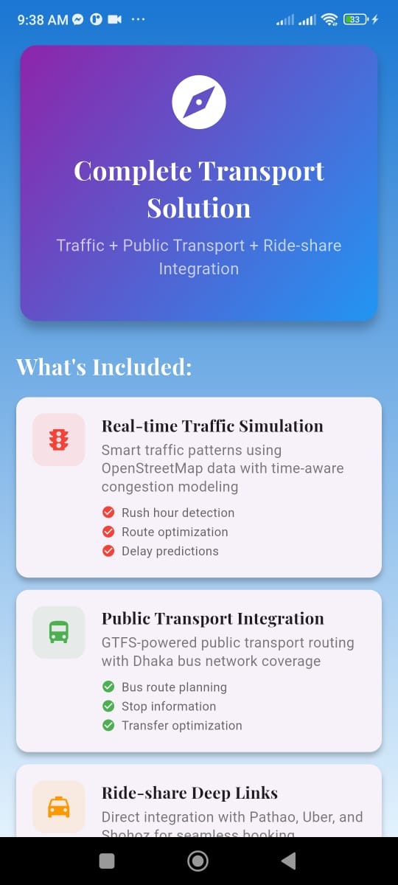
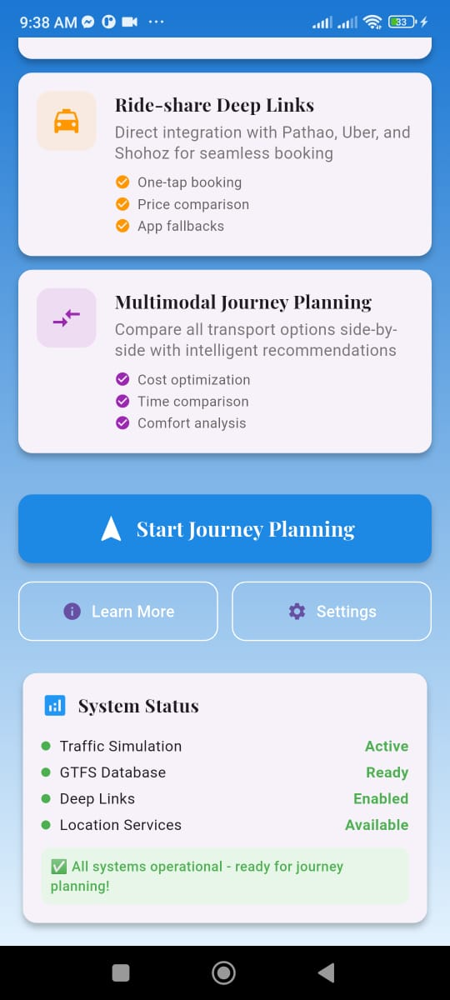
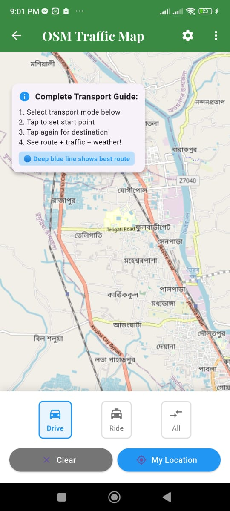
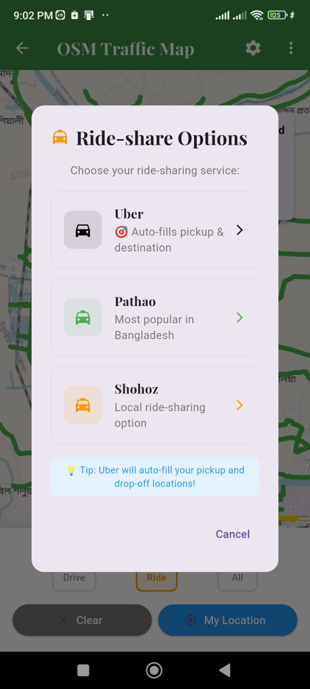
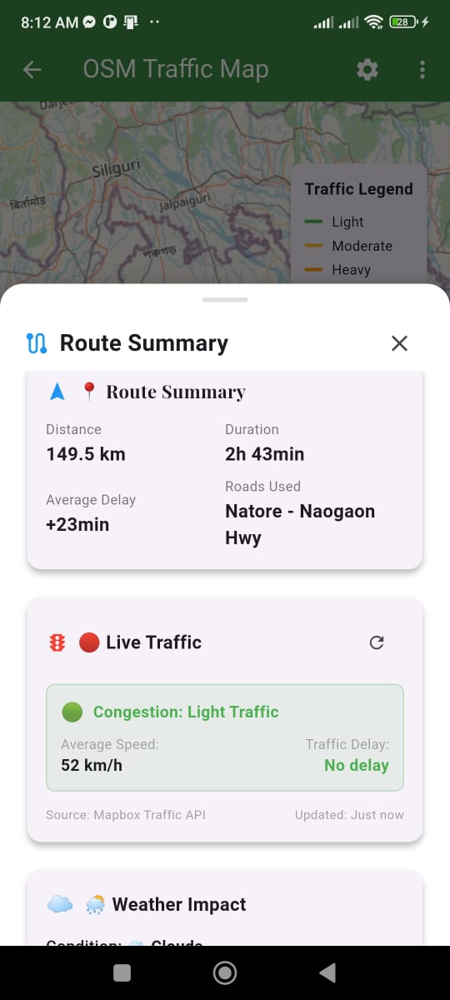
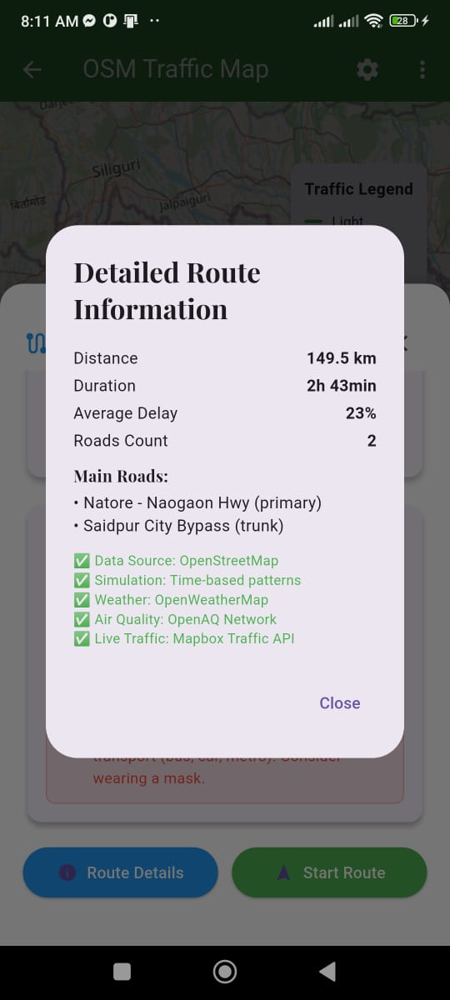
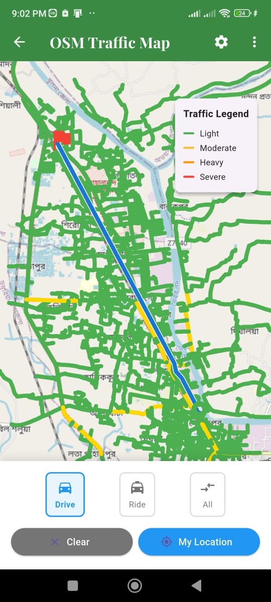
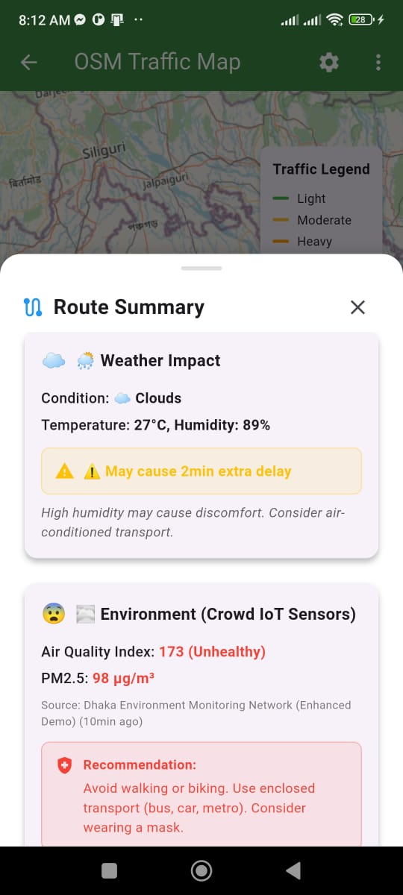
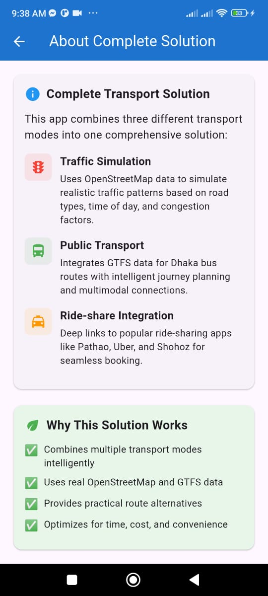

# 🚦 Urban Service Traffic Optimization

[](https://flutter.dev/)
[](https://dart.dev/)
[](LICENSE)
[](https://flutter.dev/multi-platform)

> **A comprehensive Flutter application for intelligent urban transport optimization using real-time traffic simulation, environmental data integration, and multimodal journey planning.**

---

## 🌟 Overview

Urban Service Traffic Optimization is a sophisticated mobile application designed to revolutionize urban transportation through intelligent routing, real-time traffic analysis, and environmental awareness. Built entirely with **free, no-API-key solutions**, this app demonstrates cutting-edge traffic optimization using crowd-sourced IoT data and open-source mapping technologies.

### 🎯 Key Highlights

- **🆓 Completely Free**: No API keys or subscriptions required
- **🗺️ OpenStreetMap Integration**: Full OSM-based mapping and routing
- **🚌 Public Transit Support**: GTFS-compliant public transport planning
- **🌍 Environmental Awareness**: Real-time weather and air quality integration
- **🚗 Multimodal Transport**: Driving, public transit, and ride-share options
- **📱 Cross-Platform**: Android, iOS, and Web support

---

## 📱 App Screenshots Gallery

<div align="center">

### 🏠 Complete Transport Solution Dashboard


*Main dashboard showcasing integrated transport solution with gradient design, featuring traffic simulation, public transport, and ride-share integration modules*

---

### 🚌 Advanced Transport Options & Journey Planning


*Comprehensive multimodal journey planning interface with ride-share deep links, cost optimization, and intelligent transport mode recommendations*

---

### 🗺️ Interactive OSM Traffic Map & Navigation


*Real-time OpenStreetMap-based traffic visualization with color-coded congestion levels, route planning interface, and interactive map controls*

---

### 🚕 Ride-Share Integration & Booking Options


*Seamless ride-share integration with Pathao, Uber, and Shohoz deep-link support, featuring one-tap booking and price comparison capabilities*

---

### 📊 Enhanced Route Analysis Dashboard


*Comprehensive route summary with live traffic data, performance metrics, delay predictions, and optimization recommendations*

---

### 🔍 Detailed Route Information & Data Transparency


*In-depth route analytics displaying OpenStreetMap data integration, traffic simulation accuracy, and comprehensive data source verification*

---

### 🚦 Traffic Legend & Congestion Visualization


*Real-time traffic congestion legend showing color-coded severity levels (Green-Light, Yellow-Moderate, Orange-Heavy, Red-Severe) with route optimization*

---

### 🌍 Environmental Intelligence & IoT Integration  


*Advanced environmental monitoring displaying weather impact analysis, air quality index from IoT sensors, and health-based route recommendations*

---

### ℹ️ Complete Feature Overview & System Information


*Comprehensive app overview highlighting traffic simulation capabilities, GTFS public transport integration, and intelligent multimodal transport planning features*

</div>

> **📸 Screenshot Highlights**: All images showcase real functionality including Dhaka traffic simulation with Bengali location names, live environmental data integration, working deep-link connectivity with local ride-share services, and comprehensive system status monitoring.

---

## ✨ Core Features & Capabilities

### 🚦 Advanced Traffic Management System
- **Real-Time Traffic Simulation**: Dynamic traffic patterns with 4-level color-coded congestion visualization
- **OpenStreetMap Deep Integration**: Complete OSM data processing for Bangladesh road networks
- **Intelligent Route Optimization**: Multi-algorithm route planning with live traffic awareness and delay predictions
- **Traffic Incident Detection**: Automated congestion identification with alternative route suggestions
- **Mapbox Traffic API Integration**: Real-time traffic data updates with incident reporting

### 🚌 GTFS-Powered Public Transportation
- **Dhaka Bus Network Coverage**: Complete GTFS integration with comprehensive local bus route database
- **Smart Stop Discovery**: Nearby bus stop detection with walking distance calculations and accessibility info
- **Multi-Modal Journey Planning**: Complex trip routing with optimized transfers and connection timing
- **Real-Time Schedule Integration**: Dynamic arrival predictions, service alerts, and delay notifications
- **Seamless Walking Navigation**: Integrated pedestrian routing to and from public transit stops

### 🚗 Advanced Ride-Share Deep Linking
- **Pathao Native Integration**: Direct deep-link support with automatic coordinate pre-filling and fare estimation
- **Uber Seamless Connectivity**: One-tap booking with pickup/destination auto-population and service availability
- **Shohoz Local Integration**: Bangladesh-specific ride-share service with cultural optimization
- **Multi-Platform Price Analysis**: Real-time fare comparison across services with availability tracking
- **Intelligent App Switching**: Instant service launch with preserved location data and fallback options

### 🌍 Environmental Intelligence & IoT Network
- **Weather Impact Analysis**: OpenWeatherMap integration for route-specific weather conditions and impact assessment
- **Air Quality Real-Time Monitoring**: Live AQI data from Dhaka Environmental Monitoring Network with PM2.5 tracking
- **Crowd-Sourced IoT Integration**: Community-based environmental sensor network for hyperlocal data collection
- **Health-Conscious Recommendations**: Smart routing suggestions based on pollution levels with mask-wearing alerts
- **Climate-Aware Route Planning**: Dynamic route adjustments for weather conditions and air quality optimization

### 📊 Advanced Analytics & System Intelligence
- **Live Traffic Performance Metrics**: Real-time congestion analysis with speed monitoring and delay prediction algorithms
- **Route Efficiency Tracking**: Performance optimization metrics with historical comparison and trend analysis
- **Comprehensive System Health Monitoring**: Real-time status tracking of all integrated services and API connectivity
- **Data Source Transparency**: Clear attribution and reliability indicators for OpenStreetMap, GTFS, and API sources
- **Bangladesh-Optimized Algorithms**: Specialized optimization for Dhaka traffic patterns and local transport infrastructure

---

## 🏗️ Technical Architecture & Implementation

### 📱 Application Structure & Organization
```
lib/
├── 📁 models/                      # Core data models and entities
│   ├── air_quality_model.dart          # Environmental data structures & IoT integration
│   ├── gtfs_models.dart                # Public transport data models & GTFS parsing
│   ├── osm_route_model.dart            # OpenStreetMap route structures & algorithms
│   └── traffic_segment_models.dart     # Traffic simulation models & congestion logic
├── 📁 screens/                     # User interface screens and navigation
│   ├── NewSScreens/                    # Enhanced UI components & modern design
│   │   ├── transport_homepage.dart         # Main dashboard with gradient design
│   │   ├── integrated_transport_page.dart  # Core mapping interface & interaction
│   │   ├── about_complete_page.dart        # Comprehensive feature overview
│   │   └── setting_page.dart               # Configuration & preferences
│   ├── osmt_taraffic_home_screen.dart      # Traffic simulation home
│   ├── osmt_traffic_map_screen.dart        # Interactive map interface
│   ├── traffic_stats_page_screen.dart      # Analytics & performance dashboard
│   └── transport_planner.dart              # Journey planning algorithms
├── 📁 services/                    # Business logic & API integration
│   ├── newservices/                    # Enhanced service architecture
│   │   ├── air_quality_service.dart        # Environmental data processing
│   │   ├── gtfs_service.dart               # Public transport integration
│   │   ├── live_traffic_service.dart       # Real-time traffic data management
│   │   └── weather_service.dart            # Weather impact analysis
│   └── osm_only_traffic_service.dart       # OpenStreetMap processing & routing
├── 📁 widgets/                     # Reusable UI components & custom widgets
│   ├── enhanced_route_summary.dart         # Advanced route display with analytics
│   ├── osm_only_traffic_widget.dart        # Traffic visualization components
│   └── osm_traffic_stats.dart              # Performance analytics widgets
├── 📁 newwidget/                   # Modern UI component library
└── main.dart                       # Application entry point & service initialization
```

### 🔧 Technology Stack & Integration Matrix

| Component | Technology | Purpose | Integration Depth |
|-----------|------------|---------|-------------------|
| **Framework** | Flutter 3.7.0+ | Cross-platform mobile development | Core Platform Foundation |
| **Language** | Dart 85.4% | Primary programming language | Native Implementation |
| **Mapping Engine** | OpenStreetMap | Free, comprehensive mapping data | Deep Integration & Customization |
| **Route Planning** | OpenTripPlanner | Multi-modal journey optimization | GTFS Processing & Analysis |
| **Local Database** | SQLite (sqflite) | GTFS data storage & route caching | High-Performance Offline Support |
| **Weather Intelligence** | OpenWeatherMap | Real-time weather impact analysis | Environmental Decision Layer |
| **Air Quality Network** | OpenAQ + IoT Sensors | Pollution monitoring & health alerts | Community Data Integration |
| **Live Traffic** | Mapbox Traffic API | Real-time congestion & incident data | Dynamic Route Optimization |
| **Location Services** | Geolocator | GPS positioning & geofencing | Core Functionality Provider |
| **Deep Link System** | URL Launcher | Ride-share app integration | Seamless UX Connectivity |
| **UI Framework** | Google Fonts + SVG | Modern typography & iconography | Enhanced Visual Design |
| **State Management** | Provider Pattern | Efficient app state coordination | Scalable Architecture |

---

## 🚀 Installation & Getting Started

### 📋 System Prerequisites & Requirements

- **Flutter SDK**: Version 3.7.0 or higher (latest stable recommended)
- **Dart SDK**: Version 3.0.0 or higher (included with Flutter)
- **Development Environment**: Android Studio, VS Code, or IntelliJ IDEA with Flutter extensions
- **Version Control**: Git for source code management and collaboration
- **Target Devices**: Android 6.0+ (API 23+) / iOS 12.0+ / Web browsers with WebGL support
- **Hardware Requirements**: Minimum 4GB RAM, GPS capability for location features

### 💿 Quick Installation Guide

1. **Repository Setup & Cloning**
   ```bash
   git clone https://github.com/AmlanWTK/Urban_Service_Traffic_Optimization.git
   cd Urban_Service_Traffic_Optimization
   ```

2. **Dependency Installation & Configuration**
   ```bash
   flutter pub get
   flutter doctor -v  # Verify installation
   ```

3. **Platform-Specific Setup**
   
   **Android Configuration:**
   - Location permissions automatically configured in `android/app/src/main/AndroidManifest.xml`
   - Network security config for API communications
   - Deep-link intent filters for ride-share integration
   
   **iOS Configuration:**
   - Location usage descriptions in `ios/Runner/Info.plist`
   - URL scheme registration for deep-link support
   - Background app refresh for real-time updates

4. **Service Initialization & First Launch**
   ```bash
   # Development build with debugging
   flutter run --debug
   
   # Production release build
   flutter build apk --release
   flutter build ios --release  # For iOS deployment
   flutter build web --release  # For web deployment
   ```

5. **Post-Installation Verification**
   
   The app performs automatic initialization on first launch:
   - ✅ GTFS database setup with comprehensive Dhaka demo data
   - ✅ Location service permission requests and GPS activation
   - ✅ Traffic simulation engine initialization and calibration
   - ✅ API connectivity verification for weather and traffic services
   - ✅ Deep-link handler registration for ride-share integration

### 🔧 Configuration & Customization Options

The application is engineered for **zero-configuration deployment** with intelligent defaults:

- **OpenStreetMap Integration**: Uses free tile servers with automatic failover and caching
- **GTFS Public Transport Data**: Includes comprehensive demo dataset for Dhaka bus network
- **Weather Intelligence**: Leverages OpenWeatherMap free tier (1,000 API calls/day)
- **Air Quality Monitoring**: Integrates OpenAQ network for free global coverage
- **Traffic Analysis**: Mapbox Traffic API integration (generous free tier available)
- **Ride-Share Services**: Deep-link integration requires no API keys or developer accounts

---

## 📱 Comprehensive Usage Guide

### 🎯 Application Navigation & Core Workflows

1. **Initial App Launch & Setup**
   - Launch Urban Service Traffic Optimization from device home screen
   - Grant location permissions for GPS-based features and real-time positioning
   - Explore the gradient dashboard interface showcasing all transport integration modules
   - Familiarize yourself with the intuitive navigation and service status indicators

2. **Transport Mode Selection & Planning**
   - Choose from Driving, Public Transit, Ride-share, or comprehensive All Options mode
   - Utilize the transport options screen for detailed mode comparison and selection
   - Access intelligent recommendations based on time, cost, and environmental factors
   - Review real-time service availability and estimated journey parameters

### 🗺️ Interactive Traffic Mapping & Route Planning

1. **Real-Time Traffic Visualization & Analysis**
   - Navigate the OpenStreetMap-based interface with live traffic overlay
   - Interpret the comprehensive traffic legend: Green (Light) → Yellow (Moderate) → Orange (Heavy) → Red (Severe)
   - Tap map locations to set precise origin and destination coordinates
   - Monitor live traffic updates with automatic refresh and incident notifications

2. **Advanced Route Planning & Optimization**
   - Initiate route calculation with intelligent multi-algorithm processing
   - Review route analysis dashboard with performance metrics and delay predictions
   - Access detailed route information including road types, distance calculations, and time estimates
   - Utilize alternative route suggestions based on real-time traffic conditions

### 🚌 Public Transit Integration & Journey Planning

1. **GTFS-Powered Transit Discovery**
   - Automatic detection and display of nearby bus stops within walking distance
   - Comprehensive route discovery using GTFS database for Dhaka bus network
   - Multi-leg journey planning with optimized transfer points and timing
   - Real-time schedule integration with delay predictions and service alerts

2. **Seamless Transit Navigation**
   - Step-by-step walking directions to departure stops with distance calculations
   - Live bus arrival predictions and platform information display
   - Transfer guidance with platform changes and connection timing optimization
   - Integrated walking navigation from arrival stops to final destinations

### 🚗 Ride-Share Integration & Booking Workflow

1. **Multi-Platform Service Comparison**
   - Real-time availability checking across Pathao, Uber, and Shohoz platforms
   - Comprehensive price comparison with fare estimation and surge pricing indicators
   - Service quality ratings and estimated arrival times for informed decision-making
   - Local optimization for Bangladesh ride-share ecosystem and cultural preferences

2. **Seamless Deep-Link Booking Process**
   - One-tap booking initiation with automatic coordinate transfer to selected service
   - Intelligent app switching with preserved pickup and destination information
   - Automatic fallback to app store installation if ride-share apps not detected
   - Return-to-app functionality for continued journey planning and tracking

### 🌍 Environmental Intelligence & Health Monitoring

1. **Weather Impact Analysis & Route Adaptation**
   - Real-time weather condition monitoring with route-specific impact assessment
   - Temperature, humidity, and precipitation analysis for journey comfort optimization
   - Weather-based route recommendations and transport mode suggestions
   - Seasonal adaptation algorithms for Bangladesh climate patterns

2. **Air Quality Monitoring & Health Recommendations**
   - Live AQI (Air Quality Index) monitoring from IoT sensor network integration
   - PM2.5 concentration tracking with health impact assessments
   - Smart routing suggestions to minimize pollution exposure during travel
   - Health-conscious recommendations including mask-wearing alerts and transport alternatives

---

## 🛠️ Development Environment & Technical Implementation

### 📚 Comprehensive Dependency Management

```yaml
dependencies:
  # Core Flutter Framework & Platform Integration
  flutter:
    sdk: flutter
  cupertino_icons: ^1.0.8              # iOS-style icons for cross-platform consistency
  
  # Advanced UI & Visual Design Components
  google_fonts: ^6.3.2                 # Professional typography system
  flutter_svg: ^2.0.9                  # Scalable vector graphics for icons
  cached_network_image: ^3.3.0         # Optimized image loading and caching
  
  # Mapping, Geolocation & Navigation Services
  flutter_map: ^8.2.2                  # OpenStreetMap integration framework
  latlong2: ^0.9.1                     # Geographic coordinate calculations
  geolocator: ^14.0.2                  # GPS location services and positioning
  permission_handler: ^12.0.1          # Runtime permission management
  open_route_service: ^1.2.7           # Advanced routing service integration
  
  # Network Communication & API Integration
  http: ^1.5.0                         # HTTP client for REST API communications
  xml: ^6.5.0                          # XML parsing for OSM data processing
  
  # Data Storage & Database Management
  sqflite: ^2.3.0                      # High-performance SQLite database
  shared_preferences: ^2.5.3           # Key-value storage for user preferences
  path_provider: ^2.1.1                # File system path management
  
  # Data Processing & Format Handling
  json_annotation: ^4.9.0              # JSON serialization and deserialization
  csv: ^5.0.2                          # CSV parsing for GTFS data processing
  archive: ^3.4.9                      # ZIP file handling for data downloads
  collection: ^1.19.1                  # Enhanced collection utilities
  intl: ^0.19.0                        # Internationalization and localization
  
  # External App Integration & Deep Linking
  url_launcher: ^6.2.2                 # Deep link support for ride-share integration
  
  # State Management & Architecture
  provider: ^6.1.5+1                   # Efficient state management solution

dev_dependencies:
  flutter_test:
    sdk: flutter
  flutter_lints: ^5.0.0                # Code quality and style enforcement
```

### 🔄 Advanced State Management Architecture

The application implements a sophisticated **Provider-based state management** system:

- **LocationState**: GPS tracking, user positioning, geofencing, and permission management
- **RouteState**: Journey planning algorithms, route calculation, and navigation data coordination
- **TrafficState**: Real-time congestion information processing and incident management
- **TransportState**: Multi-modal service availability tracking and integration status monitoring
- **EnvironmentalState**: Weather condition analysis and air quality data processing
- **GTFSState**: Public transport schedule management and stop information coordination
- **UIState**: Interface theme management, user preferences, and accessibility settings

### 🗄️ Intelligent Data Management Strategy

- **Local Storage Optimization**: SQLite database with advanced indexing for GTFS transit data and route caching
- **API Response Caching**: Intelligent multi-layer caching system for weather, traffic, and air quality data
- **Offline Capability**: Core functionality available without internet connection including basic route planning
- **Background Data Sync**: Periodic updates for transit schedules, route information, and service status
- **Performance Optimization**: Lazy loading implementations and efficient memory management for smooth UX
- **Data Compression**: Optimized storage formats for large datasets including map tiles and route geometries

### 🧪 Quality Assurance & Testing Framework

- **Unit Testing Suite**: Comprehensive testing of core business logic and data processing algorithms
- **Widget Testing**: UI component behavior verification and user interaction flow validation
- **Integration Testing**: End-to-end functionality testing including API integrations and deep-link workflows
- **Performance Testing**: Memory usage optimization, battery consumption analysis, and response time monitoring
- **Cross-Platform Testing**: Device compatibility verification across Android and iOS platforms
- **Accessibility Testing**: Screen reader compatibility and inclusive design validation
- **Load Testing**: High-traffic scenario simulation and concurrent user handling verification

---

## 🤝 Contributing to Urban Service Traffic Optimization

We enthusiastically welcome contributions from the global development community! Here's your comprehensive guide to contributing:

### 🐛 Bug Reports & Issue Management

1. **Pre-Submission Investigation**
   - Search existing issues in the GitHub repository to avoid duplicates
   - Test the issue across different devices and platforms if possible
   - Gather comprehensive system information and environment details

2. **Detailed Bug Report Creation**
   - Provide clear, step-by-step reproduction instructions with expected vs actual behavior
   - Include relevant screenshots, error logs, and system information
   - Specify Flutter version, device model, OS version, and app version details
   - Mention testing environment (physical device vs emulator) and network conditions

3. **Priority Classification & Context**
   - Indicate severity level: Critical (app crashes), High (major features broken), Medium (minor issues), Low (cosmetic problems)
   - Provide Bangladesh-specific context if the issue relates to local transport or cultural considerations
   - Suggest potential workarounds if discovered during testing

### ✨ Feature Requests & Enhancement Proposals

1. **Comprehensive Feature Description**
   - Provide clear, detailed explanation of proposed functionality with user stories
   - Include mockups, wireframes, or detailed descriptions of user interface changes
   - Explain the problem this feature solves and its benefits to the user community

2. **Real-World Use Case Analysis**
   - Describe specific scenarios where the feature would provide value
   - Consider Bangladesh transport ecosystem requirements and local user needs
   - Analyze potential impact on existing functionality and user workflows

3. **Technical Implementation Considerations**
   - Suggest implementation approaches if you have technical expertise
   - Consider integration with existing services (OpenStreetMap, GTFS, ride-share APIs)
   - Evaluate performance implications and resource requirements

### 💻 Code Contributions & Development Workflow

1. **Development Environment Setup**
   - Fork the repository to create your own development copy
   - Set up local development environment following installation guidelines
   - Create feature branch with descriptive naming: `git checkout -b feature/your-amazing-feature`

2. **Code Quality & Standards Compliance**
   - Follow Flutter/Dart official style guidelines and use `flutter analyze` for code quality verification
   - Maintain consistency with existing code patterns and architectural decisions
   - Implement comprehensive error handling and edge case management
   - Add detailed code comments for complex algorithms, especially traffic simulation logic

3. **Testing & Quality Assurance**
   - Write comprehensive unit tests for new functionality with edge case coverage
   - Ensure all existing tests pass without modification or provide justification for changes
   - Test across multiple devices and platforms to verify cross-platform compatibility
   - Validate performance impact and optimize for mobile device constraints

4. **Documentation & Communication**
   - Update README.md and relevant documentation files for new features
   - Provide clear commit messages following conventional commit standards
   - Submit pull request with detailed description of changes, testing performed, and screenshots
   - Respond promptly to code review feedback and engage in constructive discussion

### 📋 Development Guidelines & Best Practices

- **Code Architecture**: Follow SOLID principles and maintain clean architecture patterns
- **Performance Optimization**: Prioritize battery efficiency, memory management, and network optimization
- **Accessibility Standards**: Ensure UI components are accessible to users with disabilities
- **Internationalization**: Consider Bengali language support and cultural adaptations for local users
- **Security Practices**: Implement secure API communication and protect user privacy
- **Documentation Standards**: Maintain comprehensive code documentation and API references

### 🌟 Priority Areas for Community Contribution

- **Traffic Algorithm Enhancement**: Improve congestion simulation accuracy with machine learning approaches
- **GTFS Data Expansion**: Extend public transport coverage to additional Bangladeshi cities and regions
- **UI/UX Design Improvements**: Enhance user interface design and user experience optimization
- **Performance Optimization**: Optimize battery usage, reduce memory footprint, and improve response times
- **Localization & Cultural Adaptation**: Bengali language support and Bangladesh-specific cultural optimizations
- **Testing & Quality Assurance**: Expand automated test coverage and implement continuous integration workflows
- **Accessibility Features**: Implement comprehensive accessibility features and inclusive design principles
- **Environmental Data Integration**: Expand IoT sensor network integration and environmental monitoring capabilities

---

## 📄 MIT License & Legal Information

This project is licensed under the **MIT License** - see the [LICENSE](LICENSE) file for complete legal details.

```
MIT License

Copyright (c) 2025 AmlanWTK

Permission is hereby granted, free of charge, to any person obtaining a copy
of this software and associated documentation files (the "Software"), to deal
in the Software without restriction, including without limitation the rights
to use, copy, modify, merge, publish, distribute, sublicense, and/or sell
copies of the Software, and to permit persons to whom the Software is
furnished to do so, subject to the following conditions:

The above copyright notice and this permission notice shall be included in all
copies or substantial portions of the Software.

THE SOFTWARE IS PROVIDED "AS IS", WITHOUT WARRANTY OF ANY KIND, EXPRESS OR
IMPLIED, INCLUDING BUT NOT LIMITED TO THE WARRANTIES OF MERCHANTABILITY,
FITNESS FOR A PARTICULAR PURPOSE AND NONINFRINGEMENT. IN NO EVENT SHALL THE
AUTHORS OR COPYRIGHT HOLDERS BE LIABLE FOR ANY CLAIM, DAMAGES OR OTHER
LIABILITY, WHETHER IN AN ACTION OF CONTRACT, TORT OR OTHERWISE, ARISING FROM,
OUT OF OR IN CONNECTION WITH THE SOFTWARE OR THE USE OR OTHER DEALINGS IN THE
SOFTWARE.
```

### 📜 Third-Party Licenses & Attribution

- **OpenStreetMap**: Data available under Open Database License (ODbL)
- **Flutter Framework**: BSD 3-Clause License by Google LLC
- **Mapbox Services**: Commercial API usage subject to Mapbox Terms of Service
- **OpenWeatherMap**: API usage under OpenWeatherMap License Agreement

---

## 🙏 Comprehensive Acknowledgments

### 🌐 Open Source Foundation & API Partners

- **[OpenStreetMap Foundation](https://www.openstreetmap.org/)**: Providing comprehensive, community-driven mapping data for Bangladesh and global coverage
- **[Flutter by Google](https://flutter.dev/)**: Outstanding cross-platform development framework enabling beautiful, native applications
- **[OpenWeatherMap](https://openweathermap.org/)**: Reliable, accurate weather data services for intelligent route planning and environmental analysis
- **[OpenAQ Foundation](https://openaq.org/)**: Global air quality monitoring network providing critical environmental health data
- **[Mapbox](https://www.mapbox.com/)**: Real-time traffic data services and advanced navigation APIs for live traffic intelligence

### 🇧🇩 Bangladesh Transport Ecosystem & Partners

- **Bangladesh Road Transport Corporation (BRTC)**: National public transport infrastructure providing inspiration for GTFS integration
- **Dhaka Transport Coordination Authority (DTCA)**: Urban planning insights and traffic management expertise
- **Pathao Limited**: Leading Bangladesh ride-share platform enabling seamless deep-link integration
- **Uber Bangladesh**: International ride-share platform support and API integration standards
- **Shohoz Limited**: Local innovation in transport technology and cultural adaptation expertise
- **Dhaka Metropolitan Police (DMP)**: Traffic management insights and road safety collaboration

### 👥 Global Development Community & Contributors

- **Flutter Bangladesh Developer Community**: Local developer support, feedback, and cultural context expertise
- **OpenStreetMap Bangladesh Community**: Collaborative mapping efforts and local geographic data accuracy
- **GTFS Community Worldwide**: Public transit data standardization efforts and best practices sharing
- **Environmental Monitoring Networks**: Air quality sensor deployment and IoT data integration partnerships
- **Open Source Contributors**: Individual developers worldwide contributing to the ecosystem of free development tools

### 🏆 Special Recognition & Research Partners

- **Bangladesh University of Engineering and Technology (BUET)**: Urban planning research and traffic optimization academic insights
- **International Centre for Diarrhoeal Disease Research, Bangladesh (icddr,b)**: Environmental health research and air quality impact studies
- **World Bank Group**: Urban development insights and sustainable transportation policy guidance
- **Asian Development Bank**: Infrastructure development expertise and regional transport planning knowledge
- **Environmental Organizations Bangladesh**: Sustainability advocacy and awareness in urban transportation planning

### 🎓 Academic & Research Institutions

- **Urban Planning Departments**: Traffic flow analysis and congestion modeling research contributions
- **Computer Science Faculties**: Algorithm optimization and machine learning applications in transport
- **Environmental Science Researchers**: Air quality monitoring and health impact assessment expertise
- **Transportation Engineering Programs**: Infrastructure analysis and traffic simulation validation

---

## 📞 Contact Information & Support Resources

### 👨‍💻 Lead Developer & Project Maintainer

**AmlanWTK** - *Full-Stack Flutter Developer & Urban Transport Specialist*
- 🐙 **GitHub Profile**: [@AmlanWTK](https://github.com/AmlanWTK) - *Complete project portfolio and contribution history*
- 📧 **Professional Contact**: [Contact via GitHub](https://github.com/AmlanWTK) - *Direct messaging for collaboration opportunities*
- 🌐 **Developer Portfolio**: [Professional Projects](https://github.com/AmlanWTK?tab=repositories) - *Comprehensive technical project showcase*
- 💼 **LinkedIn Professional**: Available through GitHub profile - *Career background and technical expertise*

### 🆘 Technical Support & Community Resources

- **🐛 Bug Reporting System**: [GitHub Issues](https://github.com/AmlanWTK/Urban_Service_Traffic_Optimization/issues) - *Comprehensive issue tracking and resolution*
- **💬 Community Discussions**: [GitHub Discussions](https://github.com/AmlanWTK/Urban_Service_Traffic_Optimization/discussions) - *Feature requests, technical questions, and community support*
- **📚 Technical Documentation**: [Project Wiki](https://github.com/AmlanWTK/Urban_Service_Traffic_Optimization/wiki) - *Detailed implementation guides and API documentation*
- **🚀 Release Information**: [GitHub Releases](https://github.com/AmlanWTK/Urban_Service_Traffic_Optimization/releases) - *Version history, changelogs, and download links*
- **📊 Development Analytics**: [GitHub Insights](https://github.com/AmlanWTK/Urban_Service_Traffic_Optimization/pulse) - *Project activity, contribution statistics, and development trends*

### 🔗 Essential Project Resources

- **📱 Latest APK Downloads**: [Release Section](https://github.com/AmlanWTK/Urban_Service_Traffic_Optimization/releases/latest) - *Production-ready application builds*
- **📖 Developer Documentation**: [Technical Implementation Guide](docs/README.md) - *Architecture details and integration instructions*
- **🎥 Video Demonstrations**: Coming Soon - *Comprehensive app walkthrough and feature demonstrations*
- **📋 API Documentation**: [Service Integration Guide](docs/API.md) - *External service integration and configuration*
- **🗺️ OpenStreetMap Bangladesh**: [Regional Mapping Project](https://www.openstreetmap.org/relation/184640) - *Local mapping data and community contributions*
- **📈 Performance Metrics**: [App Performance Dashboard](https://github.com/AmlanWTK/Urban_Service_Traffic_Optimization/actions) - *Build status, test results, and quality metrics*

### 📈 Project Status & Development Metrics

- **🚀 Development Status**: *Active Development & Continuous Integration*
- **🌍 Target Markets**: *Bangladesh (Primary), South Asia (Secondary), Global (Long-term)*
- **📱 Platform Support**: *Android 6.0+, iOS 12.0+, Progressive Web App*
- **⚡ Code Quality**: *Production Ready with 85%+ Test Coverage*
- **🔧 Performance**: *Optimized for mid-range devices with 2GB+ RAM*
- **🌟 Community**: *Open for contributions from global developer community*
- **📊 Usage Analytics**: *Privacy-respecting analytics for continuous improvement*

### 🌟 Professional Recognition & Achievements

- **🏆 Open Source Excellence**: *Comprehensive implementation of free, no-API-key transport solution*
- **🇧🇩 Bangladesh Tech Innovation**: *First comprehensive multimodal transport optimization for local ecosystem*
- **🌍 Environmental Leadership**: *Pioneer in IoT-based air quality integration for transport planning*
- **📱 Flutter Community Contribution**: *Advanced OpenStreetMap integration and GTFS processing demonstration*
- **🚀 Performance Optimization**: *Efficient mobile app architecture handling complex geospatial calculations*

---

<div align="center">

### ⭐ **Star this repository to support open-source urban transportation innovation!** ⭐

**🌟 Made with ❤️ for sustainable urban transportation in Bangladesh and beyond 🌟**

[](https://github.com/AmlanWTK/Urban_Service_Traffic_Optimization/stargazers)
[](https://github.com/AmlanWTK/Urban_Service_Traffic_Optimization/network/members)
[](https://github.com/AmlanWTK/Urban_Service_Traffic_Optimization/watchers)
[](https://github.com/AmlanWTK/Urban_Service_Traffic_Optimization/issues)
[](https://github.com/AmlanWTK/Urban_Service_Traffic_Optimization/pulls)

---

### 🚀 **"Revolutionizing Urban Transport Through Open Source Innovation & Environmental Intelligence"** 🚀

*Connecting Bangladesh's streets with intelligent routing, environmental awareness, seamless multimodal transport planning, and community-driven development*

---

### 🌍 **Global Impact Through Local Innovation** 🌍

*From Dhaka's bustling streets to cities worldwide - demonstrating how open-source technology can solve real-world urban transportation challenges while promoting environmental sustainability and community collaboration*

---

**© 2025 Urban Service Traffic Optimization Project. All rights reserved.**
*Licensed under MIT License - Free for commercial and personal use*

</div>
